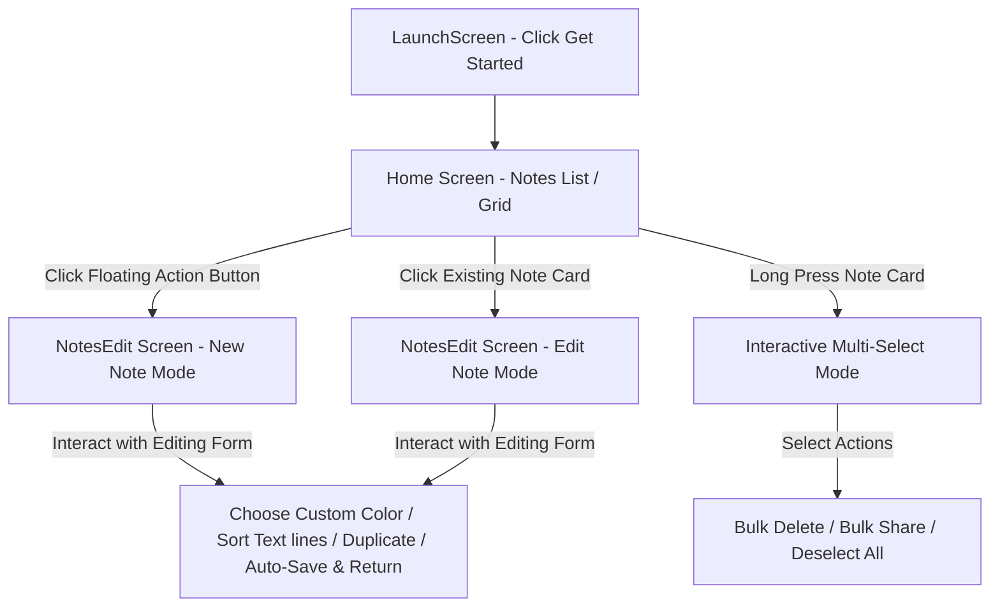

# 📝 Premium Flutter Notes App (`notes_app_new`)

[](https://flutter.dev)
[](https://dart.dev)
[](https://pub.dev/packages/sqflite)
[](#)

A high-performance, offline-first notes application built using **Flutter** and **SQLite (`sqflite`)**. This application showcases a well-structured routing system, custom theme integrations, real-time local database operations, interactive multi-select features, and aesthetic user experience flows.

---

## ℹ️ نظرة عامة على المشروع (Project Overview)

* **اسم المشروع (Project Name):** **ملاحظاتي الذكية - Smart Notes (`notes_app_new`)**
* **نبذة ووصف المشروع (Description):**
  تطبيق مميز وخفيف الوزن مصمم للهواتف الذكية لتدوين الأفكار والملاحظات اليومية وتدوين قوائم المهام بكفاءة عالية. يعتمد التطبيق بالكامل على فلسفة الحفظ المحلي دون الحاجة للاتصال بالإنترنت، مما يوفر سرعة استجابة فائقة وتخصيص كامل لألوان كل ملاحظة بشكل مرئي جذاب لتسهيل تنظيمها.

---

## ⚠️ المشاكل التي يعالجها التطبيق (Problems Solved)

* 🔐 **انتهاك الخصوصية وتسريب البيانات:**
  بينما تقوم معظم تطبيقات الملاحظات برفع بيانات المستخدمين الخاصة إلى خوادم سحابية (Cloud) مما يعرضها للاختراق، يعمل هذا التطبيق تحت فلسفة **Offline-First** حيث يتم تشفير وحفظ جميع البيانات بالكامل داخل جهاز المستخدم عبر قاعدة بيانات SQLite محلية وآمنة.
* 📦 **تشتت الأفكار والفوضى البصرية:**
  يحل التطبيق مشكلة صعوبة التعرف البصري على الملاحظات من خلال إتاحة لوحة ألوان مخصصة (`NoteColors`) لتلوين خلفية كل بطاقة ملاحظة، مما يُسهل تصنيف المهام والأفكار وعملك الشخصي بناءً على الألوان بشكل فوري.
* 📝 **إدارة وترتيب النصوص الطويلة وقوائم المشتريات:**
  يوفر التطبيق حلاً لمن يكتب قوائم طويلة (مثل قائمة التسوق أو المهام اليومية) وذلك عبر ميزة ترتيب أسطر الملاحظة أبجدياً كأداة ذكية بضغطة زر واحدة (A-Z / Z-A) دون الحاجة لنسخها وإعادة كتابتها يدويًا.
* 🚫 **صعوبة تكرار النماذج الجاهزة:**
  بفضل زر التكرار التلقائي (Duplicate Note)، يمكن للمستخدم نسخ أي ملاحظة أو نموذج بشكل سريع لتعديل بيانات جديدة عليه دون الاضطرار لنسخ النصوص ولصقها يدويًا.

---

## 👥 الفئة المستهدفة (Target Audience)

* 🎓 **الطلاب والأكاديميون:** الذين يحتاجون لحفظ الملاحظات الدراسية وتلوينها حسب المادة العلمية وتصنيفها بشكل مرئي وسريع.
* 💼 **رواد الأعمال والمهنيون:** لتسجيل الأفكار السريعة، خطط العمل اليومية، وقوائم المهام، مع الضمان الكامل لخصوصية البيانات وسرية المعلومات التجارية.
* 🔒 **عشاق الخصوصية التامة:** لكل مستخدم يبحث عن أداة بسيطة وآمنة تكتب وتعمل بدون إنترنت وبأداء خفيف على موارد الهاتف.

---

## 🚀 Key Features

* **⚡ Offline-First Architecture**: Powered by lightweight local SQLite database (`sqflite`) for super-fast offline note storage.
* **🎨 Custom Color Palettes**: Notes can be customized with dynamic, hand-picked colors (from `NoteColors`) that change note card backgrounds and accents dynamically.
* **📦 Smart Multi-Selection Flow**: Long-press any note to enter selection mode, allowing bulk actions such as **Bulk Deletion** and **Bulk Sharing**.
* **📝 Rich Editing Experience**:
  * Auto-Save on Back / Native pop events.
  * Auto-generating note titles from the first line of content if left empty.
  * Direct line sorting (A-Z and Z-A) of contents inside the note edit screen.
* **👥 Quick Duplication & Sharing**: Easily duplicate or share individual notes directly from the edit bottom sheet menu.
* **🗺️ Clean Named Routing**: Centralized routing system using a standalone `GenerateAllRoutes` controller for scale.

---

## 📱 Application Flow & UX Design



1. **Launch Entrance (`LaunchScreen`)**: A clean startup gateway featuring custom vector illustrations and interactive triggers to onboard players into the main dashboard.
2. **Main Dashboard (`Home`)**: Lists written notes. If no notes exist, shows an empty state. Includes a floating action button to create new instances, plus responsive headers that transform when notes are multi-selected.
3. **Editor Workspace (`NotesEdit`)**: Clean, minimalist inputs for note fields. Bottom sheets house controls to modify colors, duplicate records, share notes, delete, and rearrange lines locally.

---

## 🛠️ Architecture & Folder Structure

This project follows a clean logic-separated structure splitting UI elements from configurations and data persistence layers:

```
lib/
├── main.dart                 # Initial entry point of the Flutter application
├── models/
│   ├── note.dart             # Dart model object converting SQLite maps to instances
│   └── notes_database.dart   # SQLite adapter managing CRUD and connection states
├── routes/
│   └── route_generator.dart  # Centralized routing generator for screen transitions
├── screens/
│   ├── launch_screen.dart    # App launch screen
│   ├── home.dart             # Dashboard listing notes, selection utilities, action bars
│   └── notes_edit.dart       # Workspace for note writing, sorting, styling and sheet modals
└── theme/
    └── note_colors.dart      # Curated palette styling maps for individual notes
```

---

## ⚙️ Tech Stack & Dependencies

* **Core Framework**: Flutter (Dart SDK version `^3.7.2`)
* **State Management & State Updates**: Local `StatefulWidgets` utilizing clean callback interfaces (`afterNavigatorPop`, `onLongPress`, etc.).
* **Data Storage**: `sqflite: ^2.4.2` plugin for structured relational SQLite database tables.
* **Vector Handling**: Assets configured to use the local `images/img.png` splash vector illustration.

---

## 💻 Setup & Installation

Follow these setup steps to run the project locally on your machine:

1. **Clone the Repository:**
   ```bash
   git clone https://github.com/HishamZeyad1/note_app.git
   cd note_app
   ```

2. **Install Flutter Dependencies:**
   Ensure you have Flutter installed, then run:
   ```bash
   flutter pub get
   ```

3. **Verify Database Configuration:**
   Ensure SQLite database builds successfully on local mobile devices:
   ```bash
   flutter doctor
   ```

4. **Launch Application:**
   Run the project on a connected device / simulator:
   ```bash
   flutter run
   ```
